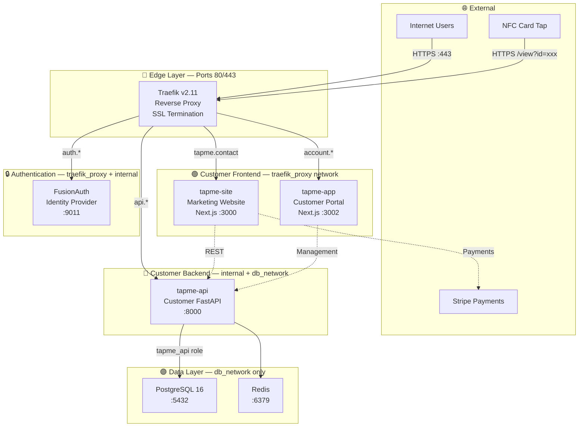
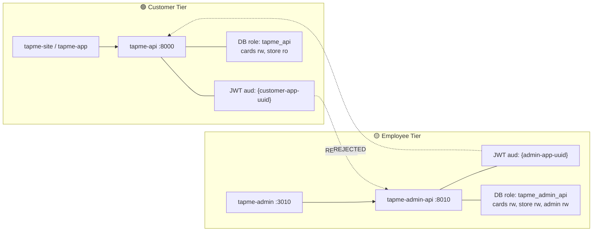
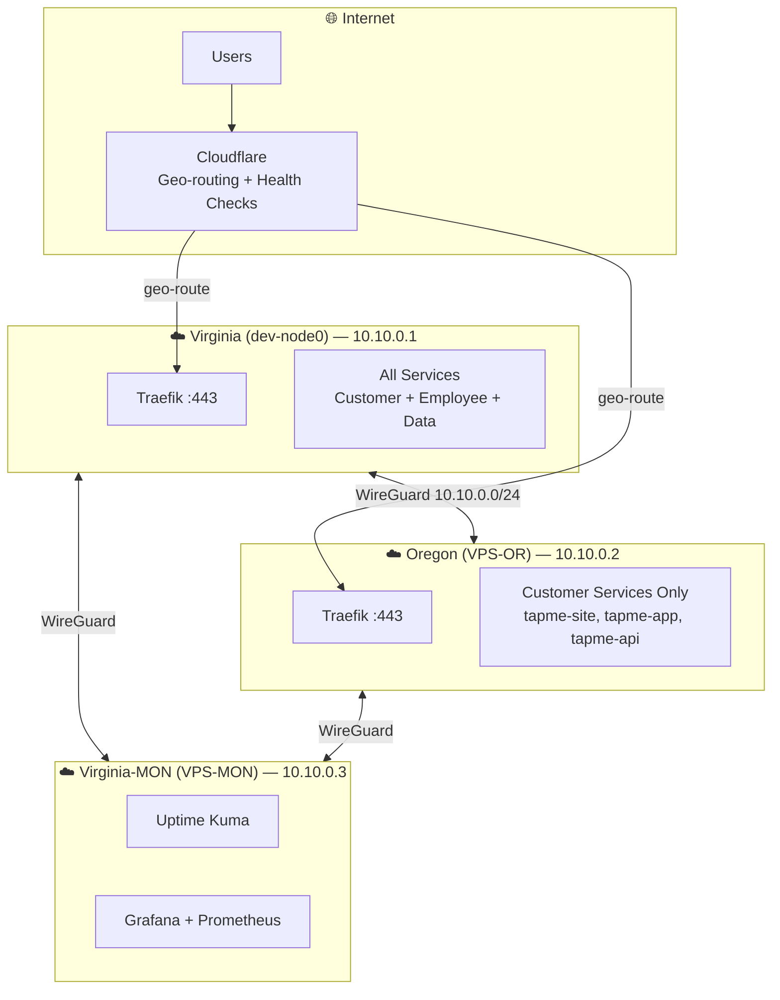
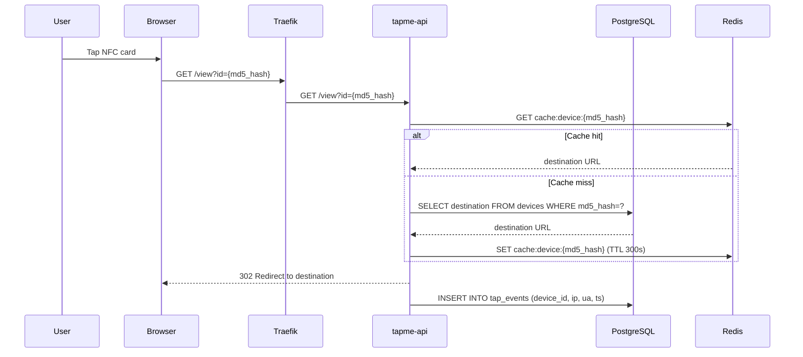
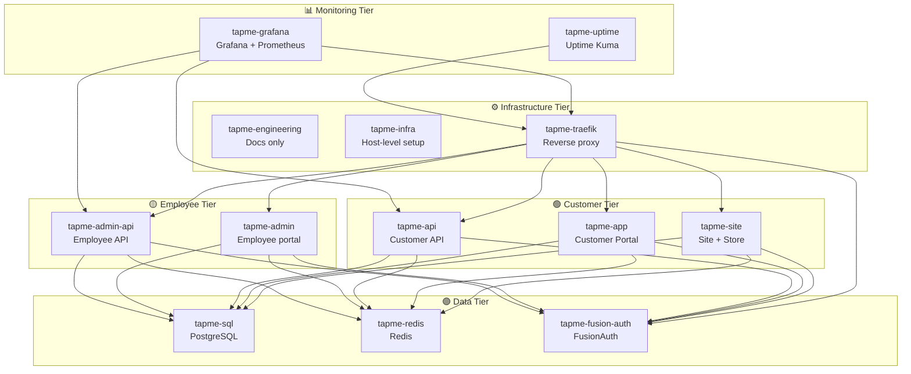

# Diagram Patterns Reference

**Version:** 1.0.0
**Date Created:** 2026-03-08
**Author:** Colin Bitterfield

Mermaid diagram patterns used in the TapMe Contact engineering wiki. Copy-paste these and adapt for any new diagrams.

---

## Rules

1. **Mermaid only** — GitHub wiki renders Mermaid natively. No GraphViz, no PlantUML, no external image services.
2. All diagrams go in fenced code blocks with `mermaid` as the language tag.
3. Use subgraphs with emoji+label headers to communicate tier/layer.
4. Explicitly show which network/tunnel inter-service calls traverse.
5. Dashed lines (`-.->`) for external/optional dependencies; solid lines (`-->`) for required paths.

---

## Color/Emoji Tier Convention

| Tier | Emoji | Label Example | Used In |
|------|-------|---------------|---------|
| External | 🌐 | `External["🌐 External"]` | Internet users, external services |
| Edge/Proxy | 🔵 | `Edge["🔵 Edge Layer"]` | Traefik, Certbot |
| Customer Frontend | 🟢 | `CustomerFE["🟢 Customer Frontend"]` | tapme-site, tapme-app |
| Customer Backend | 🔴 | `CustomerBE["🔴 Customer Backend"]` | tapme-api |
| Employee Frontend | 🟡 | `EmployeeFE["🟡 Employee Frontend"]` | tapme-admin |
| Employee Backend | 🟠 | `EmployeeBE["🟠 Employee Backend"]` | tapme-admin-api |
| Auth | 🔒 | `Auth["🔒 Authentication"]` | FusionAuth, Elasticsearch |
| Data | 🟣 | `Data["🟣 Data Layer"]` | PostgreSQL, Redis |
| Monitoring | 📊 | `Monitoring["📊 Monitoring"]` | Grafana, Prometheus, Uptime Kuma |
| Infrastructure | ⚙️ | `Infra["⚙️ Infrastructure"]` | tapme-infra, tapme-traefik |

---

## Pattern 1: Service Architecture (graph TB)

Full platform architecture showing all tiers and inter-service communication.

---

## Pattern 2: Security Boundary (graph LR)

Shows the hard security boundary between customer and employee tiers. Include JWT rejection explicitly.

---

## Pattern 3: CI/CD Pipeline (graph LR)

Shows build, test, security scan, and sequential rolling deploy.

```mermaid
graph LR
    subgraph Trigger["🟡 Trigger"]
        Dev["Developer<br/>Commit"]
        GH["GitHub<br/>Repository"]
    end

    subgraph Test["🟢 Test"]
        Lint["Lint"]
        Unit["Unit Tests"]
        Int["Integration Tests"]
    end

    subgraph Security["🔴 Security"]
        Aikido["Aikido SAST + DAST"]
        Secrets["Secrets Detection"]
    end

    subgraph Build["🔵 Build"]
        Docker["Docker Build<br/>Multi-stage"]
        Push["Push to GHCR"]
    end

    subgraph Deploy["🟣 Deploy"]
        Migrate["Alembic migrate<br/>(API only)"]
        N0["node0<br/>Sequential"]
        N1["node1<br/>Sequential"]
    end

    Dev --> GH --> Lint --> Unit --> Int
    Int --> Aikido --> Secrets --> Docker --> Push
    Push --> Migrate --> N0 --> N1
```

---

## Pattern 4: Physical Topology (graph TB)

Shows VPS hosts, WireGuard VPN, Cloudflare routing, service placement.

---

## Pattern 5: User Journey (sequenceDiagram)

For NFC tap, purchase, login, and other multi-step flows.

---

## Pattern 6: Service Tier Map (graph TB)

Simplified view organizing repos into tiers.

---

## Common Mistakes to Avoid

1. **Don't use `graph TD` and `graph TB` inconsistently** — pick one and use it for the same page. `TB` = top-bottom, `TD` = top-down, they are identical.
2. **Don't mix `-->` and `-.->` without meaning** — solid = required/primary, dashed = optional/external/read-only.
3. **Don't skip the `subgraph` for tiers** — isolation of tiers is the main value of architecture diagrams.
4. **Don't use bare node IDs** — always give nodes descriptive labels with the pattern `ID["Label detail"]`.
5. **Don't draw the monitoring connections inline with services** — keep Prometheus/Grafana/Uptime Kuma in their own subgraph and connect from there.
6. **Don't omit the network name** from edge labels when it's non-obvious (e.g., `-->|"WireGuard tunnel"| node`).
